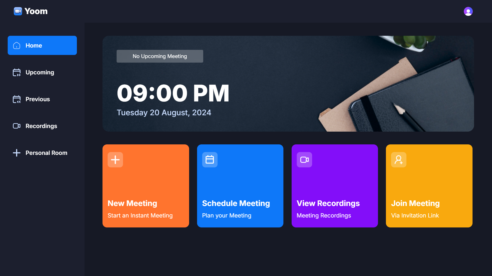
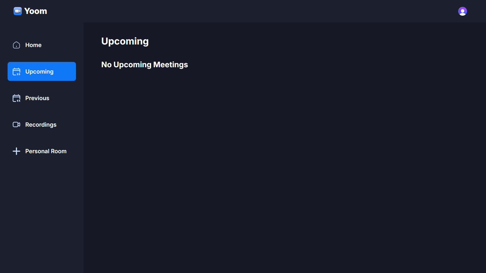
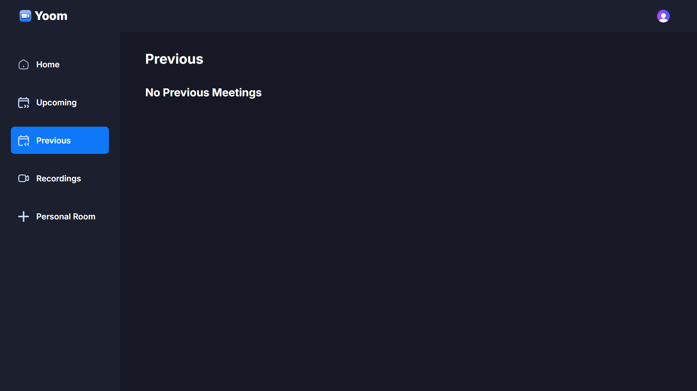
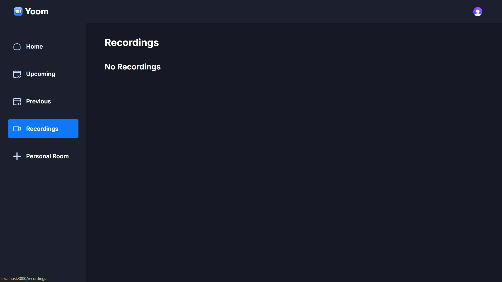
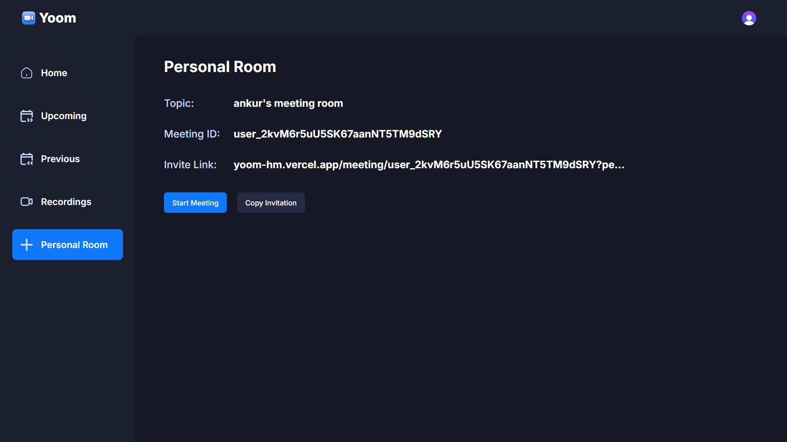

# Yoom

Yoom is a web application that replicates the core functionalities of Zoom, allowing users to create, join, and manage virtual meetings. The project leverages modern web technologies such as Next.js, Tailwind CSS, and Stream for video functionalities.

## Visit the Website

Head over to the project's website [here](https://yoom-hm.vercel.app).

## Features

### Create, Join and Manage Virtual Meetings
- **Create Meetings**: Users can schedule new meetings by providing details such as meeting title, date, time, and participants.
- **Join Meetings**: Users can join existing meetings using a unique meeting ID or link.
- **Manage Meetings**: Hosts can manage their meetings by starting, ending, and controlling participant permissions.

### View Upcoming, Previous and Recorded Meetings
- **Upcoming Meetings**: Users can view a list of all their scheduled upcoming meetings with details like date, time, and participants.
- **Previous Meetings**: Users can access a history of their past meetings, including details and summaries.
- **Recorded Meetings**: Users can view and manage recordings of their meetings, which are stored for future reference.

### User Authentication and Authorization
- **Secure Login**: Users can securely log in to the application using their credentials.
- **Role-Based Access Control**: Different roles (e.g., host, participant) have specific permissions and access levels within the application.
- **Third-Party Authentication**: Integration with third-party authentication providers (e.g., Google, Apple) for easy and secure login.

### Real-Time Updates
- **Live Updates**: The application provides real-time updates for meeting statuses, participant actions, and chat messages.
- **In-App Alerts**: Visual and audio alerts within the application to keep users informed of ongoing activities.

### Video and Audio Functionalities
- **High-Quality Video**: The application supports high-definition video streaming for clear and smooth video calls.
- **Audio Controls**: Users can mute/unmute their microphones, adjust volume levels, and use push-to-talk features.
- **Screen Sharing**: Participants can share their screens during meetings for presentations and collaborations.

### Responsive Design
- **Cross-Device Compatibility**: The application is designed to work seamlessly on various devices, including desktops, tablets, and smartphones.
- **Adaptive Layouts**: The user interface adjusts dynamically to different screen sizes and orientations, providing an optimal user experience.

### Security and Privacy
- **End-to-End Encryption**: Meetings are secured with end-to-end encryption to ensure privacy and data protection.
- **Data Compliance**: The application complies with data protection regulations such as GDPR and CCPA.

### Analytics
- **Meeting Analytics**: Hosts can access detailed analytics and reports on meeting attendance, duration, and participant engagement.
- **Usage Statistics**: Users can view their usage statistics, including the number of meetings attended, total meeting time, and more.

These features make the Yoom project a comprehensive and versatile web application for virtual meetings, providing users with a robust and user-friendly experience.

## Screenshots

### Home


### Upcoming Meeting


### Previous Meetings


### Recordings


### Personal Room


## Prerequisites

Make sure you have the following installed on your machine:

- [Git](https://git-scm.com)
- [Node.js](https://nodejs.org/en)
- [npm](https://www.npmjs.com) (Node Package Manager)

## Installation

To get started with the project, follow these steps:

1. Clone the repository:
    ```bash
    git clone https://github.com/HackesticMedusa/zoom_clone.git
    ```

2. Navigate to the project directory:
    ```bash
    cd zoom_clone
    ```

3. Install the dependencies:
    ```bash
    npm install
    ```

## Usage

To run the development server:

```bash
npm run dev
```

## Set Up Environment Variables

Create a new file named `.env.local` in the root of the project and add the following contents:

```env
NEXT_PUBLIC_CLERK_PUBLISHABLE_KEY=
CLERK_SECRET_KEY=

NEXT_PUBLIC_CLERK_SIGN_IN_URL=/sign-in
NEXT_PUBLIC_CLERK_SIGN_UP_URL=/sign-up

NEXT_PUBLIC_STREAM_API_KEY=
STREAM_SECRET_KEY=
```

Replace the placeholder values with your actual Clerk & Stream credentials. You can obtain these credentials by signing up on the [Clerk](https://clerk.com) and [Getstream.io](https://getstream.io).

## Running the Project

Open http://localhost:3000 with your browser to see the result.

## Acknowledgments

To learn more about the tools and technologies used in this project, please refer to the following resources:

- [Next.js Documentation](https://nextjs.org/docs) - Learn about Next.js features and API.
- [Tailwind CSS Documentation](https://tailwindcss.com/docs) - Learn about Tailwind CSS, a utility-first CSS framework.
- [Getstream.io Documentation](https://getstream.io/video/docs) - Learn about Stream for video functionalities.
- [Clerk Documentation](https://clerk.dev/docs) - Learn about Clerk for user authentication and authorization.
- [React Documentation](https://react.dev/learn) - Learn about React, a JavaScript library for building user interfaces.

## Contributing

Contributions are welcome! Please open an issue or submit a pull request for any improvements or bug fixes.

## License

This project is licensed under the MIT License. See the [LICENSE](./LICENSE) file for details.